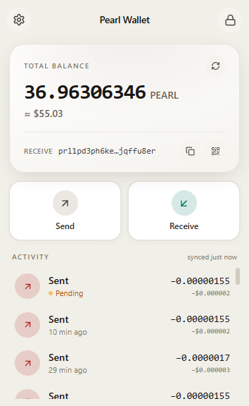

# Pearl Wallet

A non-custodial browser wallet for the [Pearl blockchain](https://pearlchain.live), a
proof-of-useful-work chain whose mining performs AI inference. Runs in Chrome and Firefox.

Your recovery phrase is generated on your device, encrypted with your password, and never
leaves the browser. There is no account, no server-side key storage, no analytics.

- **Chrome Web Store:** https://chromewebstore.google.com/detail/pearl-wallet/illgffgijkmfekknbbffpfnccbmffpho
- **Firefox Add-ons:** https://addons.mozilla.org/firefox/addon/pearl-wallet/

<p align="center"></p>

## What it does

- **Send and receive PEARL** with Taproot addresses (BIP-86, coin type 808276, `prl1p…` bech32m).
- **Several accounts from one recovery phrase**, plus importing a single private key (hex or WIF)
  or another recovery phrase as its own account.
- **12 or 24-word phrases**, on create and on import. Importing scans the common derivation
  paths and picks the one holding funds.
- **`.pns` names**: send to `alice.pns` instead of an address, show your own name on Receive,
  and transfer names you own. Coins that carry a name are never spent by an ordinary send or
  a consolidation.
- **Address book, fee tiers, price chart, transaction history**, and a UTXO sweep.
- **Choose your backend**: any `pearlchain.live` mirror or a Blockbook v2 indexer. The wallet
  detects which kind it is.

## Security model

- The recovery phrase is sealed with **AES-256-GCM**, using a key derived from your password
  with **PBKDF2-HMAC-SHA256 at 600,000 iterations** (WebCrypto, with a pure-JS fallback).
  Vaults written by versions before 1.3.2 used 100,000 iterations and are re-sealed at the
  higher setting the next time you unlock.
- Imported keys and extra recovery phrases are sealed with the master phrase rather than the
  password, so changing your password never has to touch them.
- The unlocked phrase lives in `chrome.storage.session` (memory only) and is cleared by the
  auto-lock alarm or when the popup closes, depending on your setting.
- Before signing, every input is re-checked: the address must be one this account derives, and
  the locking script is rebuilt locally instead of trusting anything the backend returned.
- Payments are only built for address types Pearl actually defines, witness v1 (Taproot) and
  v2 (P2MR) with 32-byte programs. Everything else is refused, including addresses that any
  miner could spend from.
- Permissions are `storage` and `alarms`, with host access to the explorer backends only. No
  content scripts, and a strict content security policy. Only your addresses and signed
  transactions ever leave the device.

## Build from source

Node 20.19+ or 22.12+.

```bash
npm ci
npm run build           # Chrome  → dist/
npm run build:firefox   # Firefox → dist-firefox/
```

Load `dist/` through `chrome://extensions` → Developer mode → Load unpacked. For Firefox, use
`about:debugging` → This Firefox → Load Temporary Add-on and pick `dist-firefox/manifest.json`.

`BUILD.md` documents the exact steps add-on reviewers follow, and `FIREFOX.md` covers what
differs between the two manifests.

## Development

```bash
npm run dev         # Vite dev server with hot reload
npm test            # unit tests
npm run typecheck
npm run lint
```

### Golden tests

`src/golden/` holds fixtures recorded from the released 1.3.1 build: 48 derived addresses and
keys, Taproot tweaks, sealed vault boxes, and signed transactions with their exact transaction
IDs and fees. Every change has to reproduce them byte for byte. If a refactor or a dependency
bump would alter a key, an address or a signature, these tests fail. Treat a golden change as
a consensus change: understand it before accepting it.

The test mnemonics are the standard BIP-39 test vectors. They hold no funds, and no real
wallet data is in this repository.

## Layout

```
src/
├── manifest.ts      MV3 manifest, written in TS so Vite can inline asset paths
├── popup/           the toolbar popup, which is the whole UI
├── background/      service worker: auto-lock alarm, lock on popup close
├── screens/         onboarding, dashboard, send, receive, names, settings, …
├── pearl/           chain code: addresses, BIP-32/39/86, transactions, crypto
├── state/           session, accounts, cached wallet scan, protected coins
├── storage/         the encrypted vault and address book in chrome.storage
├── api/             pearlchain.live and Blockbook v2 adapters
├── ui/              shared components
└── golden/          golden-master fixtures and their tests
```

Crypto comes from [`@noble`](https://github.com/paulmillr/noble-curves) and
[`@scure`](https://github.com/paulmillr/scure-btc-signer), which are audited, dependency-light
and WASM-free, so they run under the extension's content security policy.

## Reporting a security issue

Please report privately through GitHub Security Advisories on this repository rather than
opening a public issue. Include the version, the browser, and the steps to reproduce.

## Contributing

Issues and pull requests are welcome. Please keep `npm test`, `npm run typecheck` and
`npm run lint` clean, and do not change the golden fixtures unless the change to signing or
derivation is intended and explained.

## License

MIT. See [LICENSE](LICENSE).

This is a community project. It is not an official Pearl Research Labs product, and it comes
with no warranty: you are responsible for your own keys and backups.
